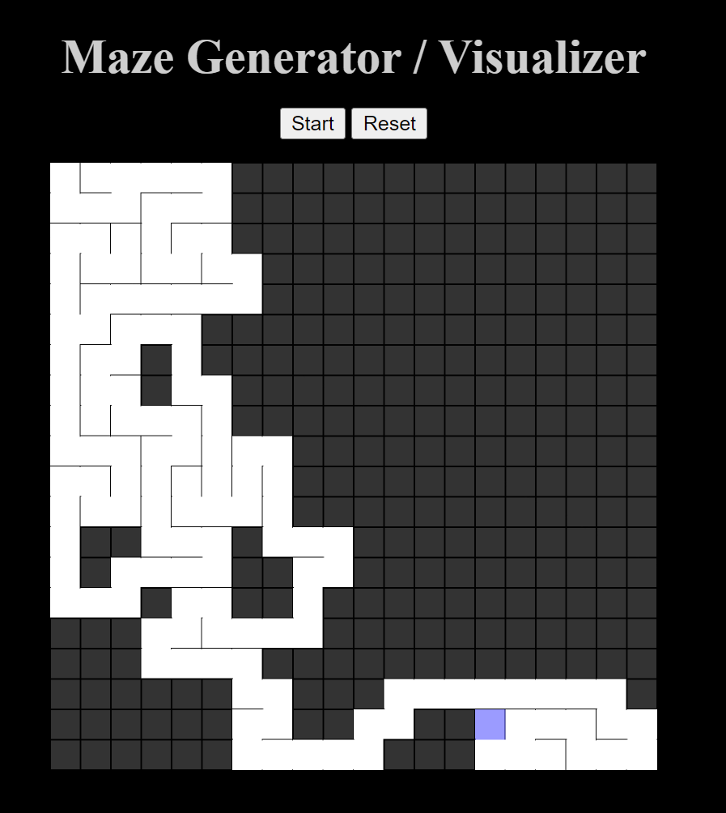
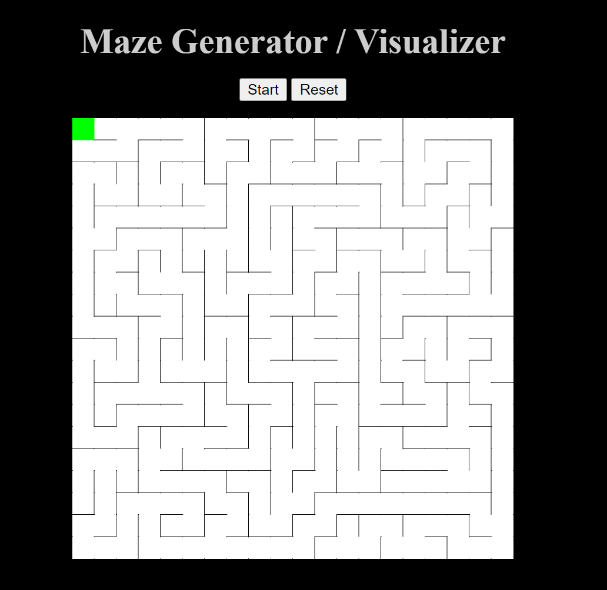

# [Maze Generator / Visualizer](https://varshithnaidulpu.github.io/Maze-Generator-Visualizer/)

This project generates a radomized maze, using an algorim call DFS which explores the deepest path and backtracks.

 

 

This project uses

- P5.js: A library which adds extra functionality for the JavaScript.
- HTML/CSS: Used to give structure and style to the page

 

 

The maze is generated so that there are no cells which can't be acessed.

 
 

 

This project covers DSA topics like recurrsion, DFS, backtracking which are fundamental in computer science and algorithm design.
